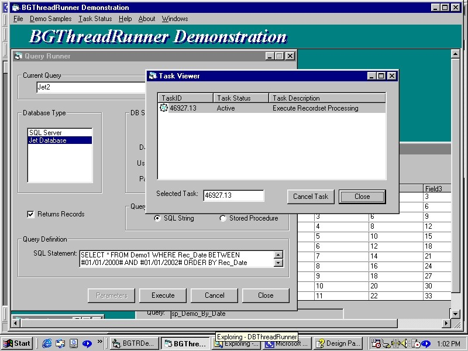



## ThreadRunner v\.1 Part 1

### Description

BGThreadRunner and DesignPatterns, Shared Memory, and Multithreading in VB6 - A Tutorial

This is a tutorial which illustrates some useful object oriented concepts and one of several ways to share common memory in the Win32 environment, which is used here to bypass the standard COM marshalling process when transferring large data objects and data objects not readily handled by standard marshalling. All these techniques are combined to create a small multithreaded task server component that can be used to run background tasks in conjunction with and for standard single threaded executables.

This is a lengthy tutorial - there are 7 projects required to build the entire application. There are 4 additional study projects that illustrate important concepts and aspects of the code and components. I had to break the zip up into four parts because the site would not accept the large download. But don't let that scare you off. ;-) This tutorial is written with intermediate level coders in mind. I've been writing VB code for less than two years. If you currently write code in class modules, jump on in, the water's fine!

First of all this is not "real multithreading", whatever that is supposed to mean. C'mon! This is VB! Get real! (so to speak ;-) If you really want real multithreading, try C++.

This is also not based on VB.NET. However, I have examined the VB.NET threading models, and I personally feel like if you are interested or planning on pursuing that course, this tutorial will in fact prove very helpful. The syntax is different, but many of the concepts are the same. The techniques shown here are based upon a task (class(es) in a DLL) joining a worker thread which then executes the task - code in the class(es). VB.NET threading is based upon a thread joining a class... I think the approach here will help you to better understand how to successfully design a class so a thread can run the code in it.

We'll use familiar VB6 techniques. The difference between this tutorial and most I have seen is we will actually try to do something with threads.

We'll look at about the simplest model for multithreading that you can actually do any kind of work with.

To get started, unzip the downloads, and make sure you recreate the original directory structure - it will expand to somewhat enormous proportions, and some of the individual source files have common names. Then double click on the HTML help file - there are several you want:

..\BGTRDemo\BGThreadRunnerDemoHelp.chm.

Please read the instructions in the help before you try to build the sample application !!!! The build cannot be consolidated into a simple group. It requires several steps, and you must follow the directions explicitly!!!

I completely tested the build from scratch using the zip file, and it worked fine. But you must perform the procedure correctly. All the required dlls, ocxs, etc. should be on any machine that has VS6/VB6 Professional or higher. The required files are also listed in tables in an appendix. The code and build have been tested and run on Win98. I was not able to test anything on NT4 or Win2K, but I have run similar code on NT4 with no problem. I do not anticipate you will encounter any problems.

If you have problems, comments, or questions, you can e-mail me. Complaints should be directed to my agent - send them to billgrates@microsloth.con.

Hopefully you'll find something of interest. Multithreading aside, there are all kinds of other goodies inside - stuff that people who actively write code for a living can actually use. I obviously have a lot of time on my hands, and not enough to do with it. I currently don't actively write code (or do anything) for a living and this stuff does not pay any bills. I am definitely available, e-mail me - I live somewhere in the 20th-21st century, Atlanta metro area. ;-)
 
### More Info
 

             |
---                |---
**Submitted On**   |2002-03-07 23:38:50
**By**             |[Robert Graham](https://github.com/Planet-Source-Code/PSCIndex/blob/master/ByAuthor/robert-graham.md)
**Level**          |Advanced
**User Rating**    |4.9 (146 globes from 30 users)
**Compatibility**  |VB 6\.0
**Category**       |[OLE/ COM/ DCOM/ Active\-X](https://github.com/Planet-Source-Code/PSCIndex/blob/master/ByCategory/ole-com-dcom-active-x__1-29.md)
**World**          |[Visual Basic](https://github.com/Planet-Source-Code/PSCIndex/blob/master/ByWorld/visual-basic.md)
**Archive File**   |[ThreadRunn60422382002\.zip](https://github.com/Planet-Source-Code/robert-graham-threadrunner-v-1-part-1__1-32466/archive/master.zip)

